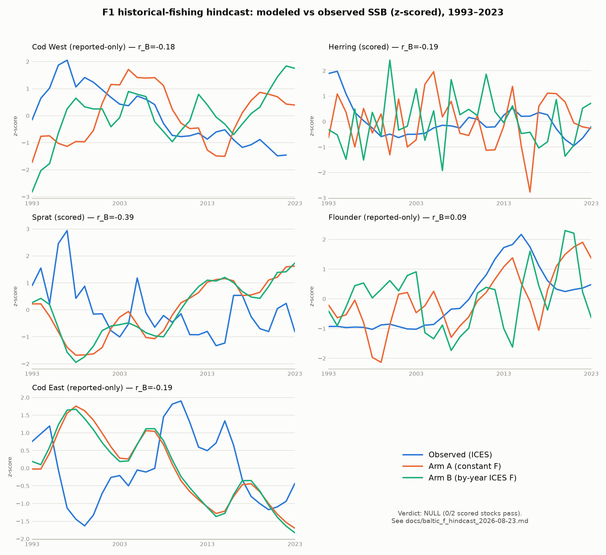

# Baltic F1 — historical-fishing hindcast: results and verdict

**Date:** 2026-08-23
**Spec:** `docs/superpowers/specs/2026-08-23-baltic-f1-historical-fishing-hindcast-design.md`
(Stage 1 of B1, F1-first staging)

## Verdict: NULL

**0 of 2 scored stocks (herring, sprat) pass.** Neither the trend test nor the skill test
clears both stocks; per the pre-registered decision in spec §4, a scored stock needs **both**
tests to pass, and the run-level verdict is PASS (2/2 stocks), PARTIAL (1/2), or NULL (0/2).

| stock | trend (≥2/3 decades) | skill (Δr ≥ 0.10 and > 2·sd) | stock verdict |
|---|---|---|---|
| herring | FAIL (1/3) | FAIL (Δr = −0.118) | FAIL |
| sprat | PASS (2/3) | FAIL (Δr = +0.005) | FAIL |

**Gating consequence (spec §4, quoted):** "A NULL result is legitimate and must be reported as
such: it **demotes Stages 2–3 from validation-motivated to capability-motivated** (the model's
equilibria don't track forcing history at decadal scale → prioritize scenario-track work like C1
over hindcast realism), and that decision rule is written down here in advance."

That rule now fires. Stage 2 (unified time policy + interannual bottom-O₂) and Stage 3
(interannual LTL via proxy) are **demoted from validation-motivated to capability-motivated** —
they should be prioritized, if at all, as general engine/data capability work, not as steps
expected to improve hindcast realism against ICES SSB history. Scenario-track work (e.g. C1) is
the spec's suggested reprioritization target.

## Honest framing

This is the **anticipated null**, not a broken-harness result. The July 2026 spike
(`docs/diagnostics/2026-07-15-ssb-f-hindcast-spike.md`) demonstrated a washout mechanism —
modeled SSB relaxes back to its intrinsic attractor within roughly 5–10 years regardless of
imposed fishing history — for cod and sprat on the pre-RV-gate, pre-E/W-split config. Stage 1
was precisely a re-test of that mechanism, on the certified 9-species config, for the two
scored stocks that hadn't been re-tested (herring, sprat). The instrument-check results below
confirm the ICES F pattern **is** reaching the fishing process each year (rho ≥ 0.97 on every
seed for every blocking stock) — so the null is a statement about the **model's equilibrium
dynamics** (SSB is dominated by the calibrated attractor, not by the imposed multi-decade F
trajectory), not about mis-wired forcing. The washout mechanism the July spike found persists on
the certified config.

## Instrument check

Rank correlation (Spearman rho) between the imposed annual F-factor pattern and arm B's realized
yield-per-biomass, 1993–2023, per seed. This is the wrong-mapping / silent-no-op canary — it must
be decisively positive for the blocking stocks before any SSB result is meaningful.

| stock | median rho | min–max rho | blocking? | result |
|---|---|---|---|---|
| herring | 0.976 | 0.973–0.981 | yes | PASS — decisively positive |
| sprat | 0.988 | 0.986–0.991 | yes | PASS — decisively positive |
| cod_east | 0.996 | 0.996–0.997 | yes | PASS — decisively positive |
| cod_west | 0.963 | 0.939–0.973 | no (reported-only; near-flat factor series, 0.90–1.21×) | strong, for context |

**Instrument gate PASSES decisively.** All three blocking stocks clear rho ≥ 0.97 on every one
of the 5 seeds; cod_west (reported-only, not a gate condition) is also strong at 0.94–0.97. The
forcing demonstrably reaches the fishing process every year — the SSB-level null below is not an
artifact of broken key wiring.

## Per-stock results

5-seed mean trajectories, arm A (constant F) vs arm B (by-year ICES F), scored against observed
ICES SSB (z-scored; herring uses the decision-6 catch-weighted z-composite of its 4-stock
complex) over 1993–2023 (sim-years 19–49). Decadal trend signs are `(1993–2002, 2003–2012,
2013–2023)`, `1` = rising, `−1` = falling.

| stock | scored? | trend B | trend obs | trend match | r_A | r_B | mean Δr ± sd | skill pass? |
|---|---|---|---|---|---|---|---|---|
| herring | **yes** | (+,+,+) | (−,+,−) | 1/3 | 0.043 | −0.195 | **−0.118 ± 0.112** | no — arm B is *worse* than baseline |
| sprat | **yes** | (−,+,+) | (−,−,+) | 2/3 | −0.398 | −0.385 | **+0.005 ± 0.044** | no — fails the 0.10 margin |
| cod_west | reported-only | (+,−,+) | (+,−,−) | 2/3 | −0.130 | −0.180 | +0.076 ± 0.268 | no (non-binding) |
| cod_east | reported-only | (+,−,−) | (−,+,−) | 1/3 | −0.261 | −0.186 | +0.077 ± 0.039 | no (non-binding) |
| flounder | reported-only | (+,+,+) | (−,+,−) | 1/3 | 0.512 | 0.086 | −0.298 ± 0.269 | no (non-binding) |

Notes on the two scored stocks:

- **Herring:** arm B is *worse* than the constant-F baseline (Δr = −0.118 ± 0.112 — the mean is
  more than 2 sd away from zero in the wrong direction, so this is a confident negative, not
  noise). The decadal trend also fails (1/3): historical F pushes modeled herring SSB
  monotonically upward across all three decades while the observed composite falls, rises, then
  falls.
- **Sprat:** the trend test passes (2/3 — arm B tracks the observed decline-then-rise-then-rise
  in the first and third decades) but the skill test fails: Δr = +0.005 ± 0.044 is the same
  magnitude as the July spike's own honest-negative delta (+0.009) that the decision-7 margin
  (Δr ≥ 0.10 and > 2·sd) was calibrated specifically to reject as noise, not signal. This is the
  margin doing its job, not a near-miss.

Reported-only stocks (cod_west, cod_east, flounder) are shown for trajectory context per spec
§4; none of their numbers are binding on the verdict. Cod is excluded from scoring by the parent
spec until C2(b); flounder is excluded per decision 5 (its calibrated base F is incommensurable
with ICES F without recalibration, out of scope here).

## Figure

Five panels (cod_west, herring, sprat, flounder, cod_east); each shows observed z (blue), arm A
z-scored 5-seed mean (orange), arm B z-scored 5-seed mean (aqua) over 1993–2023. Panel titles
mark scored vs reported-only stocks and annotate r_B. Full run report:
`docs/diagnostics/baltic_f_hindcast_report.json`.

## Limitations

- **Relative F scaling, anchored 2018–2022** (spec decision 2): `F_model(y) = base_F ×
  F_ices(y)/mean(F_ices, 2018–2022)`. Absolute ICES F is out of scope (10–25× the calibrated cod
  rates would extirpate the model stocks); the hindcast therefore tests whether the *shape* of
  historical F, applied around the calibrated operating point, moves modeled SSB toward observed
  SSB — not whether the model reproduces ICES F in absolute terms.
- **Herring's observed series is a constructed composite**, not a single ICES assessment: a
  fixed-weight (mean 1993–2023 catch share) mean of z-scores across the 4-stock herring complex
  (`her.27.25-2932`, `her.27.28`, `her.27.3031`, `her.27.20-24`), per spec decision 6. The
  construction choice changes the observed decadal trend signs and was pre-registered before this
  run for that reason.
- **cod_west data gaps:** its ICES F series ends 2021 (held at the 2021 value through 2023); its
  SSB series ends 2022. Reported-only, not scored, so these gaps do not affect the verdict.
- **Flounder is unforced in both arms** (decision 5) — its calibrated base F (1.3678/yr) is 6.4×
  its ICES anchor (0.214/yr); relative scaling would have produced an artifact extirpation (F up
  to 8.8/yr against a flat observed SSB in 1993–2008). Its panel/row here is constant-F vs
  constant-F, i.e. arm A and arm B differ only through shared-seed stochasticity and cross-species
  coupling to the four forced stocks, not through its own forcing.
- **Cod (both stocks) is reported-only**, excluded from scoring by the parent spec pending C2(b).
- The hindcast is **not a CI gate** — outcome is emergent, seed- and machine-sensitive, per the
  spec's Testing section.

## Certification guard (Task 7)

After the §2 engine hardening (case-fix on `byDt`/`catches.byYear` lookups, short-series
fail-fast, new `mortality.fishing.rate.byyear.file.sp{idx}` schema field), the standard
climatological certification run (50 yr × 5 seeds, unchanged config, `nyear=15` default) was
re-run and came back **bit-identical** to `docs/baltic_certification_2026-08-14.md` — all 9
species rows, full floating-point precision, including the 5/5 ASSESSED verdict. The engine
changes are load-path-only and touch keys absent from every shipped config; this run confirms
they are inert on the production Baltic config.

## Run provenance

- **Harness:** `scripts/baltic_f_hindcast.py` (not a CI gate — house rule, emergent/seed-sensitive
  outcome).
- **Design:** 2 arms (A = constant F, B = by-year ICES F for cod_west/herring/sprat/cod_east) ×
  5 house seeds `[42, 123, 7, 999, 2024]` × 50 simulated years, Python engine, in-memory.
- **Calendar:** sim-year 19 = 1993 (19 spin-up years at base F, shared by both arms; 31 scored
  years 1993–2023).
- **Commit range (this F1 stage, on `master`):** `5c4e82d..6c3646b` — spec, plan, engine
  hardening (`1039854`, `195175e`, `62bce96`, `160c160`), by-year F derivation
  (`3ec702c`, `a3e808a`), harness (`6c3646b`). HEAD at report time: `6c3646b`.
- **Raw report:** `docs/diagnostics/baltic_f_hindcast_report.json` (copied from the run's
  `/tmp/f1_hindcast_report.json`; committed so the numbers in this doc are independently
  re-checkable without re-running the harness).
